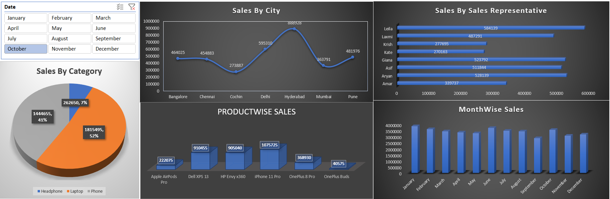

# 📊 Sales Analytics Dashboard (Excel Project)

## 🔹 Project Overview
This project is an interactive **Sales Analytics Dashboard** built using Microsoft Excel.  
The goal of this project is to analyze sales data, identify business trends, and present insights in a clear and visually appealing dashboard format.

The dataset contains **1600+ sales records** including product details, sales representatives, cities, units sold, and revenue.

This dashboard helps in understanding:
- Monthly sales performance  
- Category-wise revenue  
- Top performing sales reps  
- City-wise sales distribution  
- Overall business KPIs  

---

## 🎯 Objectives
- Convert raw sales data into meaningful insights  
- Practice Excel data analysis & dashboard skills  
- Create an interactive and professional dashboard  
- Improve data storytelling using charts and KPIs  

---

## 📁 Dataset Details
The dataset includes the following columns:

| Column Name | Description |
|------------|-------------|
| Date | Sales date |
| Product | Product name |
| Category | Product category |
| Sales Rep | Sales representative |
| City | City of sale |
| No.of Units | Units sold |
| Price | Price per unit |
| Amount | Total revenue |

Total Records: **1600+**

---

## 📊 Dashboard Features
### KPI Cards
- Total Revenue  
- Total Units Sold  
- Total Orders  
- Average Sales  

### Charts Used
- 📈 Monthly Sales Trend  
- 📊 Category-wise Revenue  
- 🏙 City-wise Sales  
- 🧑‍💼 Sales Rep Performance  
- 🥧 Category Distribution  

### Filters / Slicers
- Month  
- Category  
- City  
- Sales Representative  

These filters allow users to interact with the dashboard and analyze data dynamically.

---

## 🛠 Tools & Skills Used
- Microsoft Excel  
- Pivot Tables  
- Pivot Charts  
- Slicers  
- Data Cleaning  
- Data Formatting  
- Dashboard Design  
- Data Visualization  

---

## 🔍 Key Insights
- Identified highest revenue month  
- Found top-performing sales representatives  
- Analyzed best-selling product categories  
- Compared sales across different cities  
- Observed monthly sales trends  

---

## 📸 Dashboard Preview

  

---

## 🚀 Learning Outcome
Through this project, I learned:
- How to clean and prepare raw data  
- How to build interactive dashboards  
- How to use Pivot Tables effectively  
- How to present data visually  
- How to extract business insights from data  

This project helped me strengthen my foundation in **Data Analytics and Excel Dashboarding**.

---

## 🎓 Acknowledgment
I improved my understanding of dashboard creation by learning from YouTube tutorials by **Luke Barousse**, whose Excel and data analytics content was very helpful during this project.

---

## 📌 Future Improvements
- Add Power BI version of dashboard  
- Add forecasting analysis  
- Automate data updates  
- Create advanced KPIs  

---

## 👨‍💻 Author
**Pratham Agrawal**  
Aspiring Data Analyst  

---

## ⭐ If you like this project
Feel free to star the repository and share your feedback!
